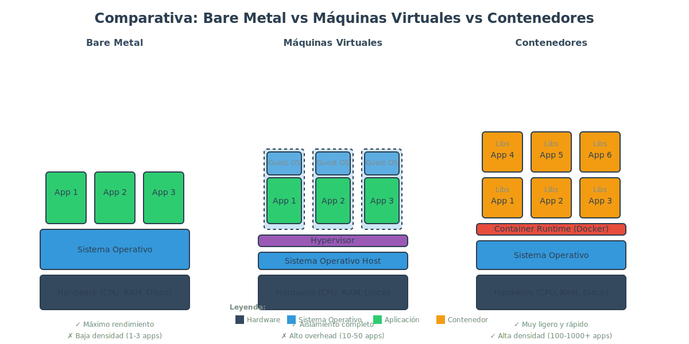

# 1.1 Beneficios de los contenedores y comparación con bare metal y VMs

## El Problema: "Funciona en mi máquina"

Un problema común es que nuestra aplicación funcione perfectamente en nuestro entorno local, pero cuando la llevamos a los entornos de producción o los servidores donde van a estar alojados empezamos a tener problemas. Esos problemas muchas veces son por dependencias. Diferentes versiones de librerías, motores de ejecución de nuestro lenguaje, etc.

Esto hace que los tiempos de depuración y arreglar esos errores sean más largos de lo deseado. Lo que conocemos como el "Funciona en mi máquina", es decir, la aplicación funciona perfectamente en mi entorno local pero una vez quiero subirlo a los servidores, ya es otra historia.

## La Solución con Contenedores

Este es uno de los problemas que vamos a solucionar usando contenedores. Lo que tenemos en nuestro entorno local va a ser una copia exacta de lo que vamos a tener en nuestros servidores. No solo en cuanto a código y versiones de librerías dentro de nuestro framework, sino también de librerías del sistema. Además de esto tenemos otras ventajas, esta vez en el lado del uso de recursos.

## Bare Metal vs Máquinas Virtuales vs Contenedores: Una Comparativa

| Característica | Bare Metal | Máquinas Virtuales | Contenedores |
|----------------|------------|-------------------|--------------|
| **Rendimiento** | Máximo | Alto | Muy Alto |
| **Tiempo de arranque** | Minutos | 1-2 minutos | Segundos |
| **Uso de recursos** | 100% dedicado | Alto (incluye OS completo) | Bajo (solo proceso) |
| **Aislamiento** | Físico | Completo (OS separado) | A nivel de proceso |
| **Portabilidad** | Baja | Media | Muy Alta |
| **Densidad** | 1 app/servidor | 10-50 apps/servidor | 100-1000 apps/servidor |
| **Escalabilidad** | Manual y lenta | Rápida | Muy rápida |

### Bare Metal (Servidores Físicos)

Históricamente, el despliegue de aplicaciones se hacía directamente en un servidor físico, preparado para alojar nuestra aplicación, es decir, que tenía instalado el motor que hacía que nuestra aplicación pudiera ejecutarse.

**Ventajas:**
- Máximo rendimiento con hardware dedicado

**Desventajas:**
- Problemas a la hora de escalar el hardware
- Necesidad de parar la máquina para actualizaciones físicas (agregar memoria, etc.)

### Máquinas Virtuales

Este tipo de problemas fueron solucionados con la popularización de las máquinas virtuales, donde el hardware completo que da soporte a un sistema operativo es virtualizado, pudiendo configurar máquinas virtuales por cada una de nuestras aplicaciones e incluso pudiendo cambiar sus especificaciones a golpe de click. Más memoria, más CPU o lo que necesitáramos.

**Ventaja principal:**
- **Consolidación de recursos:** En lugar de tener una máquina física con 32 GB de RAM y ocho núcleos de procesador para hostear nuestra aplicación, disponemos de esos recursos para crear diferentes máquinas virtuales más pequeñas donde cada una ejecutará un sistema operativo completo con los recursos mínimos que necesitemos. Así aprovechamos mucho más los recursos.

**Desventajas:**
- Cada VM requiere un sistema operativo completo (consume 512MB-2GB solo en el OS)
- Tiempo de arranque más lento (1-2 minutos por VM)
- Mayor consumo de recursos incluso en estado inactivo
- Overhead de gestión y mantenimiento de múltiples sistemas operativos

### Contenedores

Después llegaron los contenedores, donde en lugar de ejecutar un sistema operativo completo en una máquina virtual, solo ejecutamos una copia del proceso principal que hará que nuestra aplicación pueda estar corriendo. Con esto conseguimos consolidar los recursos aún mucho más, eliminando lo que conocemos como el **overhead del sistema operativo**, es decir, esos recursos que necesitamos consumir solo para que un sistema operativo completo esté corriendo, cuando de esa máquina virtual, en realidad, solo necesitamos un par de cosas, que es el proceso que da servicio a nuestra aplicación.

Los contenedores ofrecen un enfoque mucho más ligero y eficiente para aislar las aplicaciones sin necesidad de virtualizar todo el hardware de un servidor físico y simplemente compartiendo esas funciones desde el núcleo o kernel del sistema operativo anfitrión.

**Tecnologías clave:**
El aislamiento de recursos se logra utilizando características modernas del kernel de Linux, como:

- **cgroups (Control Groups):** Controlan y limitan el uso de recursos del sistema (CPU, memoria, disco I/O, red) que pueden usar grupos de procesos. Por ejemplo, puedes limitar un contenedor a usar máximo 512MB de RAM y 50% de una CPU.

- **namespaces:** Proporcionan aislamiento de diferentes aspectos del sistema. Cada contenedor tiene su propia vista aislada de:
  - **PID namespace:** Procesos (cada contenedor ve solo sus propios procesos)
  - **Network namespace:** Interfaces de red, puertos, rutas
  - **Mount namespace:** Sistema de archivos
  - **User namespace:** Usuarios y grupos
  - **IPC namespace:** Comunicación entre procesos
  - **UTS namespace:** Hostname del sistema

Estas tecnologías permiten optimizar la gestión de recursos y aislar los procesos de forma segura y eficiente.

**Ventajas de los contenedores:**
- ⚡ **Inicio rápido:** Arrancan en segundos, no minutos
- 💾 **Eficiencia de recursos:** Consumen 10-100x menos memoria que VMs equivalentes
- 📦 **Portabilidad:** "Empaqueta una vez, ejecuta en cualquier lugar" - mismo contenedor en desarrollo, testing y producción
- 🔄 **Escalabilidad:** Fácil crear y destruir miles de contenedores dinámicamente
- 🔧 **Consistencia:** Elimina el problema "funciona en mi máquina"
- 🏗️ **Densidad:** Permite ejecutar cientos o miles de aplicaciones en el mismo hardware

## ¿Cuándo usar cada tecnología?

### Usar Bare Metal cuando:
- Necesites máximo rendimiento absoluto (bases de datos de alto rendimiento, HPC)
- Tengas requisitos de compliance muy estrictos
- Ejecutes aplicaciones con necesidades de hardware específico

### Usar Máquinas Virtuales cuando:
- Necesites aislamiento completo a nivel de sistema operativo
- Ejecutes aplicaciones legacy que requieren un OS específico
- Necesites diferentes kernels de Linux o Windows en el mismo hardware
- Requisitos de seguridad extremos donde el aislamiento del kernel es crítico

### Usar Contenedores cuando:
- Desarrolles arquitecturas de microservicios
- Necesites desplegar aplicaciones de forma rápida y consistente
- Quieras maximizar la densidad de aplicaciones
- Necesites escalado rápido y dinámico
- Trabajes con CI/CD y DevOps
- Desarrolles aplicaciones cloud-native
